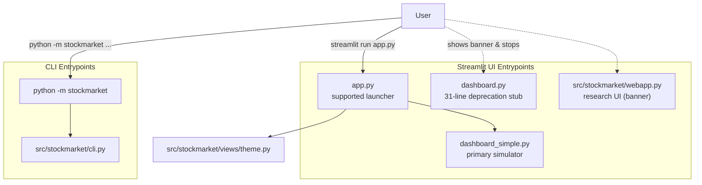
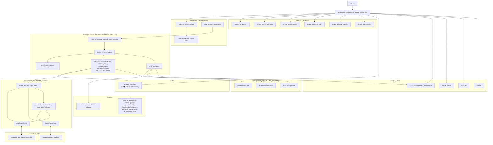
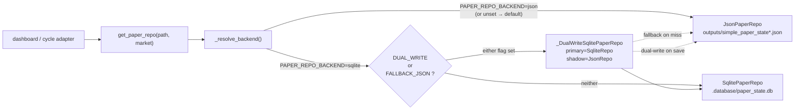
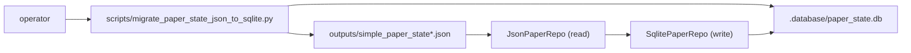

# Codebase Dataflow Diagrams

Last reviewed: 2026-05-21 (post-architecture-migration).

These Mermaid diagrams describe the runtime after the phase 1–9 migration on `arch-migration-plan`. The legacy MVC stack is gone; the supported runtime is `app.py` → `dashboard_simple.render_simple_dashboard()` over the `domain` / `state` / `cycle` / `persistence` / `views` packages.

## Runtime entrypoints

## Supported dashboard dataflow

## Persistence factory branching

## Backtest dataflow

## Migration script (one-shot, retained as future-proofing)

The script is not on the active runtime path — it exists for the eventual SQLite default-flip rollout.

## Source-of-truth pointers

- `MIGRATION.md` — phase-by-phase record of what shipped and why.
- `CODEBASE_STRUCTURE.md` — package layout, feature flags, runtime flow narrative.
- `README.md` — how to run the app and CLI.
