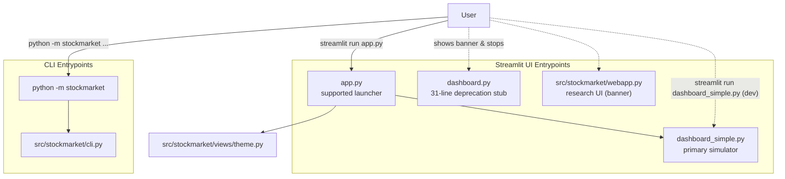
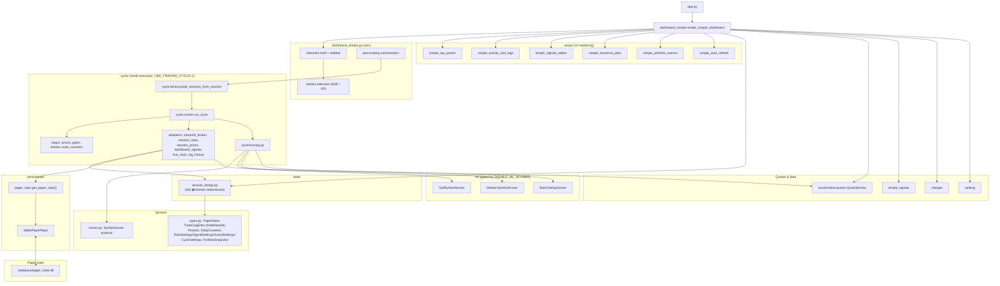
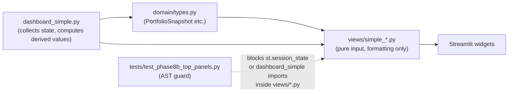
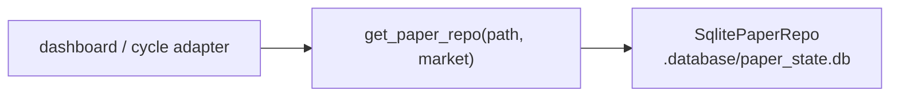
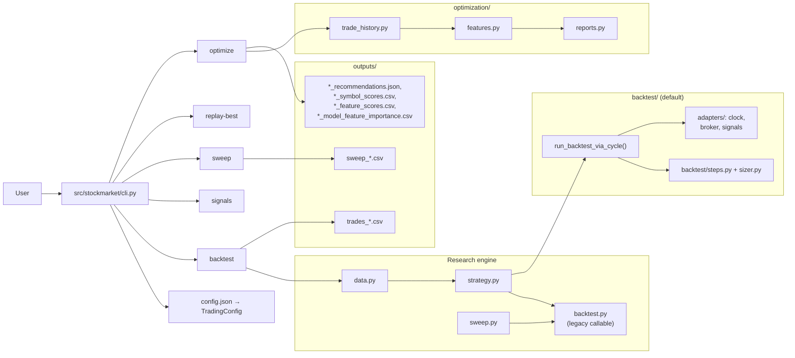
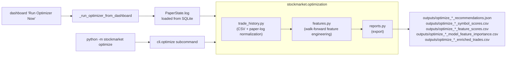
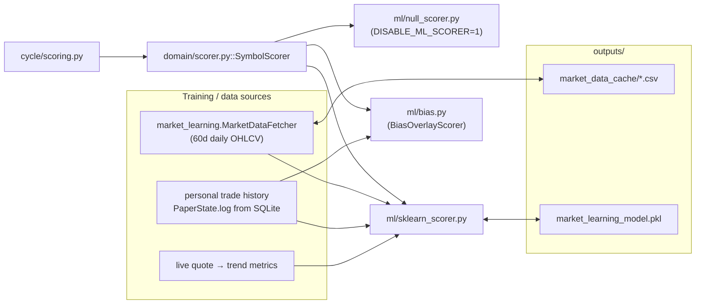

# Codebase Dataflow Diagrams

Last reviewed: 2026-05-21 (post-architecture-migration).

These Mermaid diagrams describe the runtime after the phase 1–9 migration on `arch-migration-plan`. The legacy MVC stack is gone; the supported runtime is `app.py` → `dashboard_simple.render_simple_dashboard()` over the `domain` / `state` / `cycle` / `persistence` / `views` packages.

Companion docs: `CODEBASE_STRUCTURE.md` (what exists and where), `MIGRATION.md` (phase ledger), `README.md` (install + CLI reference), `ML_MARKET_LEARNING.md` (scorer subsystem deep dive).

## Runtime entrypoints

`streamlit run app.py` is the supported launcher; `streamlit run dashboard_simple.py` is the dev-time alternative (same code, runs `render_simple_dashboard(standalone=True)`). `dashboard.py` is a 31-line deprecation stub.

## Supported dashboard dataflow

### One auto-paper cycle, in order

Whether driven by the legacy `_auto_paper_cycle()` body or by `cycle.runner.run_cycle()` (when `USE_TRADING_CYCLE=1`), each polling tick executes the same ordered pipeline. The cycle package makes the order explicit; the legacy path inlines it.

```mermaid
flowchart LR
  Tick["dashboard tick"] --> S1["1. refresh holding prices\n(cycle/steps/prices.py)"]
  S1 --> S2["2. market-open / weekend gate"]
  S2 --> S3["3. roll daily counters\n(cycle/steps/counters.py)"]
  S3 --> S4["4. profit ladder state machine"]
  S4 --> S5["5. profit guard state machine"]
  S5 --> S6["6. forced exits: SL / TP / time /\nladder / guard / square-off\n(cycle/steps/exits.py)"]
  S6 --> S7["7. signal-based exits"]
  S7 --> S8["8. re-entry cooldown + regime gate\n(cycle/entry/cooldown.py)"]
  S8 --> S9["9. rank + effective scores\n(_rank_signals_for_cycle rank only;\napply_scorer in entries/exits;\ncycle/entry/sizing.py)"]
  S9 --> S10["10. place entries (long/short)\n(cycle/steps/entries.py +\nstreamlit_broker adapter)"]
  S10 --> S11["11. record trades, mutate state,\nPaperRepo.save()"]
```

### View layer boundary

Views are pure-input modules. They take dataclasses or simple primitives, render Streamlit widgets, and must not import `dashboard_simple` or touch `st.session_state`. Violations are caught by AST walkers in `tests/test_phase8b_top_panels.py`.

| Module | Inputs | Outputs |
|---|---|---|
| `views/simple_top_panels.py` | auto-trade flags, clean-trades stats, AI best-action payload, optimizer summary | top control + status row |
| `views/simple_activity_and_logs.py` | activity feed list, log buffer | activity / log panel |
| `views/simple_signals_tables.py` | top-5 buy / sell candidate rows, error banners | live tables fragment |
| `views/simple_tomorrow_plan.py` | next-session plan rows | Tomorrow Plan expander |
| `views/simple_portfolio_metrics.py` | `PortfolioSnapshot` (with pre-computed `equity_delta` + `net_realized`) | portfolio metrics block |
| `views/simple_auto_refresh.py` | refresh-interval seconds, current tick state | footer auto-refresh widget |
| `views/theme.py` | (none) | injected CSS / Streamlit theme |

## Persistence factory

`get_paper_repo(path, market)` is the single composition site for paper-state storage. It always returns `SqlitePaperRepo`; `path` is accepted only for compatibility with older callers.

## Backtest dataflow

CLI is the entry; `run_backtest()` routes through the cycle adapters (`run_backtest_via_cycle()`). `run_backtest_legacy()` remains for parity tests only.

## Optimizer dataflow

Two entry points share the same engine: the dashboard's "Run Optimizer Now" button and the CLI `optimize` command. Both land in `stockmarket.optimization`.

## ML scoring dataflow

`SymbolScorer` is the Protocol the cycle consumes. Three implementations live under `ml/`; the historical-bootstrap pipeline that feeds the sklearn scorer lives in the legacy `market_learning.py` module plus `cycle/scoring.py`. A deeper subsystem walkthrough (training data, accuracy expectations, retrain cadence) is in `ML_MARKET_LEARNING.md`.

## Fresh local start

Paper state starts blank when `.database/paper_state.db` is absent. Old `outputs/simple_paper_state*.json` files are not read or written and can be removed with other local artifacts.

## Source-of-truth pointers

- `MIGRATION.md` — phase-by-phase record of what shipped and why.
- `CODEBASE_STRUCTURE.md` — package layout, design patterns, feature flags, common commands.
- `README.md` — how to install, run, and drive the CLI.
- `ML_MARKET_LEARNING.md` — ML scorer subsystem deep dive.
