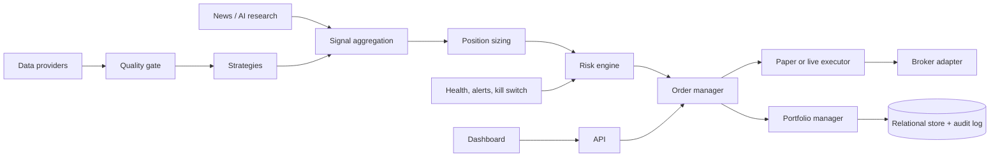

# Architecture Audit (Phase 0)

Date: 2026-10-05  
Repository: KatkarPankaj/Trading-strategy  
Scope: Non-destructive audit of the legacy implementation (baseline). Revised after verification: sections 16-18 add the required topic coverage, an evidence inventory and a status-since-baseline table.

> Reading guide. Sections 1-15 describe the repository as it was before the production migration (legacy dashboards, `src/stockmarket/*.py`). Parts of the working tree have since been extended with new modules under `src/stockmarket/core/`, `api/`, `dashboard/` and `ops.py`. Where a baseline statement is no longer true it is marked "(baseline)" and the current state is recorded in section 18.

## 1) Executive Summary

The repository is a working paper-trading/research simulator with useful features (strategy scoring, backtest, parameter sweep, paper portfolio, and Streamlit dashboards), but it is currently a monolith around India intraday assumptions and UI-driven orchestration.

It is not yet production-grade for live execution and not yet globally extensible by architecture. The highest-risk gaps are:

- Tight coupling of business logic to Streamlit UI state.
- No broker abstraction and no live/paper execution boundary as separate engines.
- No formal risk engine with mandatory pre-trade checks and explicit reject reasons.
- Market assumptions hard-coded across modules (time window, timezone, symbols, session hours).
- File-based mutable state with no transactional guarantees.
- Data-provider reliability and validation safeguards are partial.
- Limited automated testing footprint (baseline: no test suite was detected; see section 18).

## 2) Current Architecture

## 2.1 Source Layout

Primary code paths are:

- dashboard.py (large advanced Streamlit app with scanning, paper execution, strategy tracking, persistent pending orders, and learning heuristics)
- dashboard_simple.py (lightweight Streamlit app with signal ranking + auto paper cycle + state snapshots)
- src/stockmarket/config.py (TradingConfig dataclass)
- src/stockmarket/data.py (Yahoo fetch + cache)
- src/stockmarket/strategy.py (ORB + VWAP signal columns)
- src/stockmarket/backtest.py (single-position-at-a-time backtest)
- src/stockmarket/sweep.py (parameter sweeps)
- src/stockmarket/cli.py (backtest/signal/sweep/replay commands)
- src/stockmarket/webapp.py (legacy streamlit frontend invoking core functions)

## 2.2 Architectural Style Observed

Current style is a hybrid:

- Library-style modules in src/stockmarket for data, strategy, backtest, CLI.
- Two UI-first apps that also host core domain logic and execution logic.
- File persistence (JSON/CSV) used as system-of-record for paper state and history.

No explicit domain-layer boundaries currently exist for:

- instruments
- orders and order lifecycle
- broker adapters
- risk decisions
- portfolio engine
- market sessions/calendars
- audit and event store

## 3) Current Data Flow

## 3.1 Market Data

- Yahoo path:
  - src/stockmarket/data.py fetch_intraday_data downloads yfinance bars, standardizes columns, converts timezone, filters fixed session window, and caches with pickle.
- NSE quote path:
  - dashboard.py and dashboard_simple.py call nsepython directly for quote-equity endpoint.

Observations:

- Data-provider calls are made directly in dashboards and strategy orchestration, not behind an abstract provider interface.
- Session filtering in src/stockmarket/data.py is hard-coded to 09:15-15:30.
- There is retry/backoff for Yahoo only; no comprehensive stale/missing/duplicate timestamp quality gate that blocks trading globally.

## 3.2 Configuration

- config.json and config.example.json load into TradingConfig.
- Many runtime behaviors in dashboards are side-bar controls and session_state values beyond TradingConfig.

Observations:

- Typed config is present but incomplete for production concerns (environment, secrets, runtime mode, broker config, risk policies).

## 4) Current Strategy Flow

- Core indicator/signal generation in src/stockmarket/strategy.py:
  - OR high/low, VWAP, volume spike, long_signal, short_signal.
- Dashboard-level strategy scoring and plan generation:
  - dashboard.py has mode-specific score_signal and separate quote-based/yahoo-based planning.
  - dashboard_simple.py has separate ranking logic with regime-like hints and learning score adjustments.

Observations:

- Strategy semantics are duplicated across files.
- No common Strategy interface returning a normalized Signal object.
- Multiple ad-hoc signal formats exist (DataFrame columns, dict plans, UI labels).

## 5) Current Execution Flow

## 5.1 Backtest

- src/stockmarket/backtest.py simulates entries/exits from long_signal/short_signal.
- Applies slippage and commission, with stop/target/time/square-off exits.

Limitations:

- Simplified fill model (single-bar checks, no partial fills, no latency model, no order queue model).
- One-in/one-out intraday position model per day loop; no portfolio-level cross-symbol constraint engine.

## 5.2 Paper Trading (Dashboards)

- Both dashboards contain direct order execution functions mutating state and writing files.
- Position and cash calculations are embedded in UI script runtime.

Limitations:

- No standalone OrderManager state machine.
- No broker adapter abstraction even for paper path.
- Idempotency and duplicate-order defenses are not formalized as a reusable service.

## 6) Current Persistence

Current persistent artifacts:

- JSON state files (for active paper session)
- CSV ledgers/history/daily summaries
- Snapshot JSON files
- Cached market data pickle files in .cache

Risks:

- No transactional integrity or locking model.
- Concurrent writes/race conditions possible if multiple instances run.
- Pickle usage in cache has integrity/security implications if cache files are tampered with.
- No normalized relational schema for orders/fills/positions/risk decisions.

## 7) Current Risk Controls (What Exists)

Positive controls detected:

- Per-trade and per-position checks in dashboards (qty/notional limits, margin/cash checks).
- Entry windows and square-off windows.
- Stop-loss and take-profit calculations.
- Max trades/day and max open positions controls.
- Additional quality gates in advanced dashboard (score, reward/risk, expected edge).

Critical gaps:

- No centralized non-bypassable RiskEngine component.
- No explicit RiskDecision object with approved/rejected + reason ID.
- No comprehensive portfolio-level exposure/correlation/sector constraints at engine level.
- No global kill switch framework decoupled from UI.

## 8) Key Weaknesses and Coupling

## 8.1 UI-Business Logic Coupling

- Streamlit session_state is used as a de facto domain store and orchestration layer.
- Order execution, risk checks, ranking, persistence, and analytics are mixed with rendering code.

Impact:

- Hard to test deterministically.
- Hard to reuse logic for API/live execution.
- Increased regression risk when changing UI.

## 8.2 Duplicated Logic

Examples:

- Charges and trade accounting logic appear in both dashboards.
- Signal ranking and strategy plan logic are split and partially duplicated.
- Separate persistence conventions across dashboards (different state formats/files).

## 8.3 Error Handling Pattern

- Many broad except Exception blocks with continue/pass fallback behavior.

Impact:

- Operational faults may be suppressed.
- Difficult root-cause analysis.

## 8.4 Documentation Drift

- DOCUMENTATION.md contains statements that diverge from current code in places (for example, references to implementation details not matching current file behavior and legacy descriptions).

## 9) Security Issues and Risks

1. config.json is tracked and currently includes runtime settings. No dedicated secret handling strategy is implemented (even though values shown are non-secret at present).
2. .env is ignored, but no .env.example exists to enforce secret separation conventions.
3. Cache uses pickle load/dump; tampered local cache files can be a code-execution vector in hostile environments.
4. Extensive file writes from UI loops without integrity checks/audit signatures.
5. No structured redaction rules for logs/history if sensitive fields are introduced later.

## 10) Production Blockers

1. No paper/live hard separation with safety gates.
2. No broker adapter interface or live execution service.
3. No typed, environment-aware production settings model.
4. No database persistence layer with migration/versioning.
5. No service/API layer for headless operation; logic tied to dashboards.
6. No comprehensive automated tests for risk/order/execution invariants.
7. No observability baseline (structured logs, health checks, alerts).

## 11) Internationalization Blockers

1. Hard-coded market assumptions:
   - Asia/Kolkata defaults
   - 09:15 / 15:15 / 15:30 session logic
   - Fixed India watchlists and .NS-centric symbol sets
2. Session filtering in data layer fixed to India regular hours.
3. Strategy execution windows and day-boundary logic are exchange-specific and embedded in dashboards.
4. Currency assumptions are INR display-centric in UI/accounting labels.

## 12) Dead Code / Fragility Indicators

- src/stockmarket/webapp.py appears to be a legacy UI path while dashboards dominate interactive usage.
- Multiple paths produce overlapping outputs, increasing maintenance burden.
- No tests directory was present at baseline; behavior relied on manual run-time validation (see section 18 for the current test suite).

## 13) Recommended Migration Plan (High-Level)

The following plan is incremental and preserves current working functionality.

Phase A: Foundation (no behavior break)

1. Introduce new package skeleton for layered architecture (core/data/strategies/risk/execution/brokers/persistence/monitoring/config/api).
2. Add typed settings loader (env + json overlays) and explicit runtime mode flags.
3. Create domain models for Instrument, Signal, Order, Position, RiskDecision.

Phase B: Extract and Stabilize Engines

1. Extract paper order execution from dashboards into PaperExecutor + OrderManager.
2. Introduce RiskEngine as mandatory pre-trade gate used by paper executor.
3. Add MarketSession abstraction and move all time-window logic out of strategy/UI.

Phase C: Provider Abstraction

1. Define MarketDataProvider interface and adapters:
   - YahooResearchProvider
   - NSEQuoteProvider (research/paper)
2. Implement data quality checks (stale/missing/duplicate timestamp validation) and fail-closed trade gating.

Phase D: Persistence and Audit

1. Add repository layer with SQLite first, PostgreSQL-ready schema.
2. Persist signals, orders, fills, positions, risk decisions, and event logs.
3. Keep CSV exports as derived artifacts, not source-of-truth.

Phase E: API + Dashboard Decoupling

1. Create FastAPI read/write endpoints.
2. Refactor Streamlit dashboards to consume service/API interfaces only.
3. Mark trading mode prominently (PAPER/LIVE).

Phase F: Testing + Ops

1. Add unit/integration tests for:
   - risk limits
  - order state transitions
   - data validity gates
   - portfolio accounting
2. Add CI checks: lint, type-check, tests, dependency/secret scanning.
3. Add structured logging + health probes + alerts.

## 14) Priority Risk Matrix

Critical:

- Missing non-bypassable risk engine
- UI-driven execution path
- No hard paper/live gate framework

High:

- Hard-coded market/session assumptions
- File-based mutable state and weak fault tolerance
- Provider abstraction missing

Medium:

- Duplicate strategy/ranking logic
- Documentation drift
- Broad exception suppression

## 15) Phase 0 Deliverables Completed

- Inspected repository source modules, dashboards, config files, requirements, and documentation.
- Produced this non-destructive architecture audit.
- Verified and completed the audit against the 16 required topics (sections 16-18).

No runtime trading logic, `config.json`, or dashboard behavior was modified by the audit work.

## 16) Required Topic Coverage

| # | Required topic | Where covered |
|---|---|---|
| 1 | Current architecture | 2, 16.1 |
| 2 | Current data flow | 3, 16.2 |
| 3 | Current strategy flow | 4, 16.3 |
| 4 | Current backtesting | 5.1, 16.4 |
| 5 | Current paper trading | 5.2, 16.5 |
| 6 | Portfolio / PnL | 16.6 |
| 7 | Configuration | 3.2, 16.7 |
| 8 | Dashboard | 8.1, 16.8 |
| 9 | Tests | 16.9, 18 |
| 10 | Security | 9, 16.10 |
| 11 | Risk management | 7, 16.11 |
| 12 | NSE / India-specific assumptions | 11, 16.12 |
| 13 | Internationalization blockers | 11, 16.13 |
| 14 | Production blockers | 10, 16.14 |
| 15 | Recommended target architecture | 13, 16.15 |
| 16 | Recommended migration sequence | 13, 16.16 |

### 16.1 Current architecture (legacy baseline)

- Two Streamlit applications carry most of the domain logic: `dashboard.py` (3,747 lines, 70 module-level functions) and `dashboard_simple.py` (1,980 lines, 30 module-level functions). They contain scanning, ranking, learning heuristics, paper order execution, charges, persistence and rendering.
- The library layer is small: `backtest.py` (407 lines), `cli.py` (538), `data.py` (168), `strategy.py` (85), `sweep.py` (74), `webapp.py` (170), `config.py` (47).
- There are no domain boundaries for instruments, orders, brokers, risk decisions, portfolio or audit in the legacy code.

### 16.2 Current data flow

- Yahoo path: `data.py` downloads via `yfinance`, normalizes columns, converts timezone, filters the configured session and caches locally (baseline cache format: pickle; now Parquet).
- NSE quote path: both dashboards import `nsepython.nsefetch` and call NSE quote endpoints directly (`fetch_nse_quote`, `_fetch_nse_quote_payload`, `scan_top_stocks_nse`).
- Data access is not behind an interface; dashboards call providers inline. Retry/backoff exists for Yahoo only. There is no stale/missing/duplicate-data gate that globally blocks trading.

### 16.3 Current strategy flow

- `strategy.py` adds opening-range high/low, VWAP, volume-spike and `long_signal`/`short_signal` columns to an OHLCV frame.
- `dashboard.py` re-implements planning and scoring (`_strategy_plan_from_yahoo`, `_strategy_plan_from_nse_quote`, `score_signal`, `scan_top_stocks`) and `dashboard_simple.py` has a separate ranking (`_rank_signals`, `_estimate_regime_from_symbols`).
- Signals exist in three shapes: DataFrame columns, dict plans, and UI labels. No common Strategy interface exists.

### 16.4 Current backtesting

- `backtest.py` simulates one position at a time per day with slippage, commission, stop/target/time exits and square-off, using next-bar-open entries and mark-to-market equity.
- Gaps (baseline): no partial fills, no latency model, no spread, no holiday calendar, no corporate actions, single instrument, no portfolio limits. `sweep.py` runs parameter grids over this engine. A walk-forward validation package (`validation/`) and robustness scenarios already exist for the legacy engine.

### 16.5 Current paper trading

- Paper execution lives in the dashboards: `_execute_paper_order`, `_auto_trade_engine`, `_auto_exit_before_close`, `_add_pending_buy_order` / `_arm_symbol` (dashboard.py) and `_auto_paper_cycle`, `_record_trade` (dashboard_simple.py).
- Cash, margin, holdings and pending orders are mutated inside Streamlit session state and written to local files. There is no order state machine, idempotency or broker abstraction in the legacy path.

### 16.6 Portfolio / PnL

- Positions, cash and margin are dictionaries in `st.session_state`; `_portfolio_snapshot` and `_current_open_pnl` derive values for display. Charges are computed separately in each dashboard (`_intraday_charges`).
- PnL history is appended to CSV (`daily_pnl_history.csv`, `paper_trade_history.csv`; `simple_trade_ledger.csv`, `simple_daily_summary.csv`) plus JSON state and timestamped snapshots under `outputs/`.
- Weaknesses: single currency (INR) implied, no realized/unrealized separation as a reusable service, no drawdown or monthly PnL tracking outside display code, duplicated accounting between the two apps.

### 16.7 Configuration

- `config.json` (tracked, 20 lines) and `config.example.json` load into `TradingConfig` (47 lines). Defaults are India-centric: `RELIANCE.NS`, `Asia/Kolkata`, 09:15 open, 15:30 close, 13:30 entry cutoff, 15:15 square-off.
- Dashboards read `config.json` at runtime and add many sidebar/session_state controls that are not part of `TradingConfig` (146 `session_state` references in `dashboard.py`, 165 in `dashboard_simple.py`; UI preferences are persisted by `_load_saved_ui_preferences`).
- No environment concept, no secret handling and no startup validation of mandatory production settings (baseline).

### 16.8 Dashboard

- Both dashboards combine rendering with orchestration, risk checks, order execution, persistence and learning. `webapp.py` is an older UI over the library modules.
- Consequences: logic cannot be unit-tested without Streamlit, cannot be reused by an API or live path, and the two apps drift (separate state formats, duplicated charges and ranking).
- Naive-time risk: `datetime.now()` without a timezone appears 8 times in `dashboard.py` and once in `dashboard_simple.py` next to timezone-aware helpers (`ist_now`, `market_now`).

### 16.9 Tests

- Baseline: none. Current: 15 test modules, 144 tests, all passing (see section 18).
- Legacy dashboards remain untested because their logic is coupled to Streamlit.

### 16.10 Security

- Baseline findings are listed in section 9. Additional observations: `nsepython` relies on unofficial calls to NSE website endpoints (availability and terms-of-use should be reviewed); dashboards write state files with no integrity protection; 34 broad `except Exception` handlers in `dashboard.py`, 11 in `dashboard_simple.py`, 3 in `data.py` and 4 in `webapp.py` can hide failures.
- `config.json` is tracked in git; `outputs/` and `.cache/` are not tracked (0 tracked files under `outputs/`).

### 16.11 Risk management (legacy)

- Controls exist but are scattered in dashboard functions: `_passes_buy_quality_gate`, `_expected_edge_after_costs`, `_max_allowed_buy_qty`, `_enforce_existing_position_qty_cap`, `_estimate_buy_block`, entry/square-off/auto-exit windows, max trades per day and open-position limits, stop-loss/take-profit.
- `_auto_tuned_quality_filters`, `_apply_learning_bonus`, `_update_learning_memory` and `_agent_tuning_plan` adjust thresholds from recent results with no minimum sample size or out-of-sample check. This conflicts with the rule that live parameters must not change from a small sample.
- No central, non-bypassable RiskEngine, no RiskDecision with reason codes, no portfolio-level sector/correlation/drawdown limits, no kill switch (baseline).

### 16.12 NSE / India-specific assumptions discovered

1. Default symbol and watchlists are NSE tickers with the `.NS` suffix: 30+ symbols in `dashboard.py` (lines 34-41) and 12 in `dashboard_simple.py`; the symbol-to-sector map (lines 45-74) and cap-bucket map (lines 78+) are Indian equities only.
2. `config.py` defaults: `market_timezone="Asia/Kolkata"`, `market_open_time="09:15"`, `market_close_time="15:30"`, `entry_cutoff_time="13:30"`, `square_off_time="15:15"`; `config.json` and `config.example.json` repeat them.
3. `nsepython.nsefetch` quote endpoint in both dashboards; `_to_nse_symbol` converts symbols to NSE format.
4. Indian intraday charge model in `_intraday_charges` (both dashboards): brokerage, exchange transaction charge, SEBI turnover fee (turnover x 0.000001), 18% GST on fees, stamp duty, and STT of 0.025% on the sell side (dashboard_simple.py lines 245-249).
5. `ist_now()` helpers (both dashboards) and market-phase logic fixed to IST.
6. Currency is implicitly INR in accounting and display.
7. Market-cap quota, price-band and cap-focus filters (`_apply_market_cap_quota`, `_apply_price_band_filter`, `_apply_cap_focus_filter`) assume Indian large/mid/small-cap buckets and INR price bands.
8. Titles and help text name NSE/BSE (`cli.py` line 61, `webapp.py` line 18, `dashboard.py` line 2).
9. `requirements.txt` includes `nsepython` as a hard dependency.
10. No holiday calendar: weekends only are implied; exchange holidays are not modeled in the legacy engine.

### 16.13 Internationalization blockers

- Items 1-10 above, plus: session filtering and entry/exit windows live in dashboards and strategy configuration rather than a market definition; symbol conventions are Yahoo `.NS`-centric; charges, lot size and tick size are not instrument attributes; there is no multi-currency accounting in the legacy path.

### 16.14 Production blockers (baseline)

See section 10. In short: no paper/live separation, no broker abstraction, no central risk gate, no typed environment configuration, no relational persistence or migrations, no API layer, no automated tests, no observability, no CI, no container or deployment assets.

### 16.15 Recommended target architecture

- Strategies and AI only produce signals or research; only the order manager can create orders, and only after a risk decision.
- Market, instrument, calendar and currency facts come from definitions, not code. Paper is the default; live requires explicit configuration and passing safety gates.

### 16.16 Recommended migration sequence

1. Domain models and market/instrument definitions. 2. Market sessions and calendars. 3. Data-provider interface with quality gates. 4. Strategy interface (migrate ORB/VWAP, add regime filter). 5. Risk engine and position sizing. 6. Portfolio and order manager. 7. Paper/live executors and broker adapter. 8. Backtesting upgrade and anti-overfitting. 9. Persistence, audit trail and versioning. 10. Observability, kill switch and recovery. 11. API, then dashboard on the API. 12. Tests, CI and security scanning. 13. Docker and deployment. 14. Documentation. 15. Retire legacy dashboards.

## 17) Evidence Inventory (verified)

| Item | Value |
|---|---|
| `dashboard.py` / `dashboard_simple.py` | 3,747 / 1,980 lines; 70 / 30 module-level functions |
| Streamlit `session_state` references | 146 / 165 |
| Broad `except Exception` / bare `except` | 34 / 11 (dashboards), 3 (`data.py`), 4 (`webapp.py`) |
| Naive `.now()` calls | 8 / 1 |
| India-specific matching lines | `dashboard.py` 180, `dashboard_simple.py` 48, `config.py` 6, `cli.py` 7, `config.json` 4, `config.example.json` 6 |
| Persisted legacy files | `outputs/paper_state.json`, `paper_trade_history.csv`, `daily_pnl_history.csv`; `simple_paper_state.json`, `simple_trade_ledger.csv`, `simple_daily_summary.csv`, `snapshots/` |
| Tracked in git | `config.json` yes; `outputs/` none |

## 18) Status Since Baseline

The repository now also contains a new platform layer. The table records the difference from the baseline findings so the audit is not misleading.

| Baseline finding | Current state |
|---|---|
| No tests | 35 test modules, 304 tests passing in the full local unittest run for this update. They cover domain models, instruments, market sessions/calendars, provider validation/resilience and quote-snapshot consistency, deterministic ORB/VWAP signals and strategy-to-aggregation guards, market-regime classification, AI strategy-ranking validation, timestamped research evidence, AI news/sector/fundamental evidence production, provider-to-aggregation strategy-pipeline behavior, authenticated API research requests and response validation, authenticated dashboard API client and read-only research UI behavior, explicit PAPER TradingService/RiskEngine routing and rejection, real PaperBroker fill and portfolio accounting, pipeline-linked decision/evidence/order audit persistence, portfolio rebuild and clean restart reconciliation, news, legacy paper order management, risk engine, portfolio risk, sizing, portfolio manager, signal aggregation, backtest validation, performance statistics, robustness, walk-forward and validation CLI/reports. This update adds persisted TradeProposal/risk-evaluation coverage for BUY/SELL, sizing and risk rejection, missing FX/stale/future inputs, idempotency, and no order/portfolio mutation. Yahoo earnings observations and NSE sector-index evidence are opt-in, require explicit configuration, and are not configured by default; NSE instrument/index membership is operator-maintained, and endpoint availability is not guaranteed. No committed tests yet cover kill switch, learning registry, API order/recovery workflows, or live-readiness modules. |
| No central RiskEngine | `core/risk.py` and `core/risk_portfolio.py` exist; legacy dashboards do not call them. |
| No order state machine / paper-live split | `core/order_management.py`, `core/executors.py`, `core/brokers.py` exist (paper default, live gated); legacy dashboards still execute orders themselves. |
| Pickle cache | `data.py` now writes Parquet. |
| No .env.example, unpinned dependencies | `.env.example` added; `requirements.txt` pinned. |
| No persistence layer / API / observability | `core/persistence/`, `api/`, `core/observability/` exist and are not used by the legacy dashboards. |
| No data-provider interface | `core/data/` (interface, mock, Yahoo adapter, factory, quality gates, resilience) exists. The API paper path now uses the configured provider through `ResilientProvider`; legacy `data.py` and dashboards still call Yahoo/NSE directly. |
| No research evidence producers | `core/research.py` includes news and provider-neutral sector/fundamental producers. They validate instrument identity, market, timestamp and age, then use a strict AI scoring schema and retain hashed provenance. Opt-in Yahoo reported-EPS and NSE sector-index adapters are available. NSE use requires an explicit, operator-reviewed symbol→index map and is limited to XNSE instruments; mapping membership is not inferred or refreshed, and automated access can be blocked or rate-limited. No provider or map is configured by default. |
| No regime engine, no Strategy interface | `core/strategies/` defines a shared contract and an ORB/VWAP implementation producing `Signal` objects. `SignalAggregator` accepts that output, uses it as the authoritative technical direction, rejects stale/unpriced/mismatched signals, and prevents HOLD or opposing research evidence from authorizing the reverse direction. `core/regime.py` evaluates a validated rolling bar window and exposes a bounded supporting score. `core/ai/analyst.py` returns structured, identity-/time-bound rankings restricted to caller-supplied strategy names; failures and invalid candidates produce no selection. `core/strategy_pipeline.py` composes provider, regime, optional AI news/sector/fundamental evidence, AI strategy selection, deterministic signal and aggregation with fresh, instrument-matched evidence. Its legacy `submit_decision()` entry is now fail-closed; only persisted Phase 2C-3 approvals can proceed through the PAPER lifecycle. Paper fills are order-linked and deterministically persisted; the legacy DataFrame-based implementation remains in use by backtests and dashboards. |
| No research API | Authenticated `POST /research` runs an advisory pipeline without submitting orders. Bootstrap accepts injected components or an explicit OpenAI-compatible HTTPS endpoint through `AI_BASE_URL`, `AI_MODEL`, `AI_API_KEY`/`AI_API_KEY_FILE`, plus validated `RESEARCH_SESSIONS`. These remain unset by default. Requests fail closed when session configuration or market-local calendar/trading-day coverage is unavailable. The API-backed dashboard exposes research, opportunity ranking, paper order review and explicit proposal acceptance; it still surfaces authenticated API errors. |
| No separate market-intelligence service / `TradeProposal` | `core/market_intelligence.py` provides a timestamped orchestrator over the existing regime/news/strategy/aggregation pipeline, with authenticated `POST /intelligence/opportunities`. It ranks candidates deterministically and returns explainable advisory proposals with `risk_status=NOT_EVALUATED`; those in-memory objects cannot be submitted. The submission endpoint accepts only persisted approved Phase 2C-3 proposals and routes them through `TradingService`/`RiskEngine`. Finnhub news and OpenAI analysis remain opt-in; Finnhub requires a secret and explicit symbol translations outside US. |
| No persisted signal sizing/risk proposal stage | `core/trade_proposals.py` consumes a persisted Phase 2C-2 signal, revalidates its linked PAPER run/research context, freshness, market session, instrument and configured FX, performs deterministic account-currency sizing, applies the existing `RiskEngine`, and persists risk decisions plus approved terminal TradeProposals in migration V11. Phase 2C-4 explicitly submits only those durable approvals, revalidating provenance and current data; order claims, orders, order-linked fill IDs, and portfolio snapshots are persisted. Phase 2C-5 uses persisted proposal-linked positions and deterministic quote-triggered stop/target exits through the same order/risk boundary; V12 stores exit proposals. Phase 2C-6 persists PaperBroker order attempts, accepted executor orders, and fill sequence (V13), with restart reconciliation and retry only when durable executor state proves non-acceptance. Phase 2C-7 provides a bounded, manually triggered PAPER cycle with idempotency, candidate checkpoints/events, account-scope lease/expiry (V14), and explicit API/CLI recovery. Neither cycle execution nor exit monitoring is scheduled or unattended; active-order reservations remain process-local. Timestamped FX observations and cross-process portfolio reservations remain gaps. |
| No CI | `.github/workflows/ci.yml` runs the unittest suite, Bandit and pip-audit for Python 3.11. The latest observed run failed during dependency installation because the pinned FastAPI/Uvicorn versions conflicted with Streamlit; compatible pins are now updated locally, but a fresh remote run is still required. CI does not constitute production or live-trading validation. |
| No docs set | `docs/ARCHITECTURE.md` records target boundaries and integration sequence; `docs/OPERATIONS.md` now documents local/Compose operations, secrets, migrations, backup/restore, and limitations. `DOCUMENTATION.md` remains legacy-app focused. |
| No deployment setup | Dockerfile, Compose, backup script and a hardened systemd unit already existed before this phase. `docs/OPERATIONS.md` documents the supplied paper-only Compose/systemd paths and their limitations; deployment has not been executed or certified in this environment. |
| Legacy dashboards contain business logic | `src/stockmarket/dashboard/` is the separate API-backed dashboard for research/opportunity ranking, order review and guarded proposal acceptance. `dashboard.py`, `dashboard_simple.py` and `src/stockmarket/webapp.py` remain distinct legacy workflows and have not been migrated into platform services; their local paper state and safeguards remain untouched. |
| Market sessions / calendar coverage | `core/trading_calendar.py` supports covered-year fail-closed behavior, holidays, weekends, early closes and recurring intraday pauses; the API rejects research requests on uncovered or closed dates. US and Xetra have 2026 holiday data; India remains uncovered until NSE and BSE official schedules are both verified and reconciled. Future years fail closed. |
| India-specific assumptions | Still present in legacy paths (section 16.12). `core/markets.py` defines US, IN and DE; India remains calendar-uncovered until both NSE and BSE official schedules are verified and reconciled. |

### Recommended next implementation phase

The separate market-intelligence orchestrator ranks timestamped proposals using the existing regime/news/strategy/aggregation pipeline; those opportunities remain advisory. Phase 2C-3 persists risk-approved proposals from stored signals; Phase 2C-4 submits only those proposals after fresh validation; Phase 2C-5 manages quote-triggered exits through RiskEngine and OrderManager; Phases 2C-6/2C-7 persist and reconcile paper executor state and support a bounded, explicitly invoked PAPER cycle. Next priorities are broader crash/concurrency/fill-ledger and API-route validation, scheduled position monitoring only after a separately approved safety phase, cross-process portfolio reservations, and timestamped FX observations. Scheduled or unattended trading has not been implemented or validated. Finnhub and OpenAI require explicit credentials/configuration. NSE sector context requires operator-reviewed symbol/index mappings; the public endpoint is not a guaranteed feed. Verify and add official BSE/NSE calendar schedules before India is treated as session-covered. Keep German and US calendars updated annually. Then migrate legacy workflows selectively without deleting local paper-state paths. Deterministic signals and RiskEngine retain authority. Do not enable live trading.
